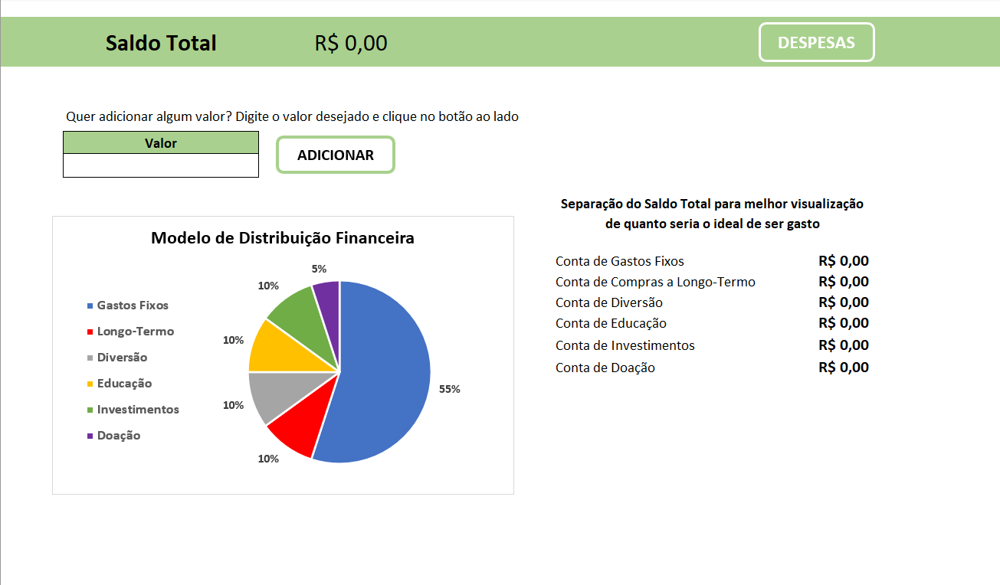
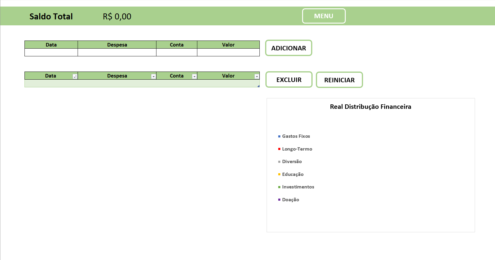

# Gerenciador Financeiro Excel com VBA

## Descrição

Este projeto é um gerenciador financeiro baseado no Excel, automatizado utilizando a linguagem de programação VBA (Visual Basic for Applications). A intenção é fornecer aos usuários uma ferramenta simplificada para gerenciar suas finanças, permitindo gerenciar despesas por qualquer período de tempo desejado. Ele segue o conceito de divisão de contas proposto por T. Harv Eker em "Os segredos da Mente Milionária".

Para garantir uma experiência do usuário mais fluida e amigável, todas as macros foram vinculadas a botões, tornando fácil e intuitivo executar funções automatizadas e manter o controle das finanças.

## Funcionalidades

### 1. Planilha "Menu"
- **Adicionar Renda**: Você pode adicionar a renda que recebeu durante um determinado período. 
- **Visualizar Saldo Total**: A renda adicionada é refletida no Saldo Total.
- **Divisão de Contas**: A renda é automaticamente dividida em 6 diferentes contas seguindo a sugestão de T. Harv Eker:
  - Gastos Fixos (55%)
  - Compras de Longo-Termo (10%)
  - Diversão (10%)
  - Educação (10%)
  - Investimentos (10%)
  - Doação (10%)
  
  Após a realização de uma despesa em qualquer uma dessas contas, o saldo é atualizado automaticamente, mostrando quanto dinheiro resta na respectiva conta.

  

### 2. Planilha "Despesas"
- **Adicionar Despesa**: Você pode adicionar uma despesa especificando:
  - Data
  - Nome da despesa
  - A conta à qual pertence
  - Valor gasto
  
  Ao clicar no botão "adicionar", as novas informações são inseridas em uma tabela e um gráfico ao lado é atualizado automaticamente, dando uma visualização clara de suas despesas.

  

### 3. Planilha "Contas"
Esta é uma planilha oculta que serve para auxiliar os cálculos matemáticos necessários para as funcionalidades das planilhas "Menu" e "Despesas".

## Como Usar

1. **Planilha "Menu"**:
   - Insira suas rendas no campo correspondente.
   - Veja sua renda sendo distribuída automaticamente entre as 6 contas propostas.
   - Observe o saldo de cada conta diminuir conforme você registra despesas na planilha "Despesas".

2. **Planilha "Despesas"**:
   - Insira a data, nome, conta e valor da despesa nos campos fornecidos.
   - Clique no botão "adicionar" para registrar a despesa.
   - Acompanhe a tabela de despesas e o gráfico para ter uma visão clara de suas finanças.

3. **Planilha "Contas"**:
   - Esta planilha opera nos bastidores e não requer interação do usuário.
